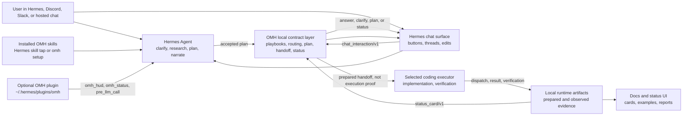

# Architecture

## Goals

The product direction is defined in `docs/DIRECTION.md`; this architecture
document describes the current module boundaries that implement that direction.

oh-my-hermes should feel like a native Hermes workflow layer, not a pile
of copied prompt files.

The architecture favors:

- Hermes-native skill installation as the primary user-facing entry point
- a thin Hermes plugin bridge for metadata-only HUD/status context
- a small support command interface for bootstrap, verification, and wrappers
- reversible local bootstrap installation
- generated skill text from testable catalog data
- explicit compatibility contracts
- conservative routing behavior
- delegation-first coding, where Hermes plans and narrates while the selected
  coding executor performs main implementation work

## System View

This is the product architecture, not the package tree. Wrappers render chat
UX, OMH produces deterministic local contracts, Hermes keeps user-facing
reasoning, and executor lanes provide observed coding evidence only after a
separate runtime record exists.



```text
Chat user
  -> Hermes Agent owns conversation, planning, and status narration
  -> Installed OMH skills provide workflow and evidence guidance
  -> Hermes chat surface asks OMH for backend contracts
  -> Executor owns main coding work when dispatched
  -> Runtime artifacts own observed evidence
```

## Package Layout

```text
src/
  chat_router.py              # compatibility adapter to routing/chat.py
  cli.py                     # compatibility adapter to commands/main.py
  commands/
    main.py                  # parser assembly and top-level error handling
    chat.py
    coding.py
    common.py
    demo.py
    docs.py
    hermes.py
    playbook.py
    runtime.py
    setup.py
    state.py
  coding_delegation.py
  coding_lifecycle.py        # compatibility adapter to wrapper/lifecycle.py
  config_adapter.py
  converter.py
  doctor.py
  hermes_planning.py
  installer.py
  manifest.py
  paths.py
  playbooks.py               # compatibility adapter to catalogs/playbooks.py
  catalogs/
    playbooks.py
    roles.py
  ingress.py
  recommend.py                # compatibility adapter to routing/recommend.py
  roles.py                   # compatibility adapter to catalogs/roles.py
  routing/
    chat.py
    policy.py
    recommend.py
  runtime_artifacts.py        # compatibility adapter to runtime/artifacts.py
  runtime_records.py          # compatibility adapter to runtime/records.py
  runtime/
    artifacts.py
    records.py
  snippet.py
  setup_profiles.py          # compatibility adapter to profiles/setup.py
  team_profiles.py           # compatibility adapter to profiles/team.py
  profiles/
    setup.py
    team.py
  wrapper_contract.py         # compatibility adapter to wrapper/contract.py
  wrapper_sessions.py         # compatibility adapter to wrapper/sessions.py
  wrapper/
    contract.py
    lifecycle.py
    sessions.py
  skill_pack.py
  core/
  skills/
    catalog.py
    packaging.py
    render.py
  plugin_bundle/
    omh/
      plugin.yaml
      config.yaml
      __init__.py
      hooks/
      tools/
skills/
  <skill-name>/SKILL.md       # tap-compatible Hermes skill pack generated from the same catalog
```

## Main Modules

`skills/` is the Hermes-native distribution surface. It mirrors the generated
skill templates so `hermes skills tap add rlaope/oh-my-hermes` can expose
OMH directly when Hermes taps are available.

`plugin_bundle/omh/` is the Hermes plugin payload installed by `omh setup` to
`~/.hermes/plugins/omh`. The v1 plugin registers a compact metadata-only
`omh_hud` tool, a detailed metadata-only `omh_status` tool, and a passive
`pre_llm_call` hook. `omh hud` exposes the same status-line payload for local
operator smoke tests. The HUD line stays limited to version, plugin bridge
readiness, target topology, current or default coding agent, and evidence
state. Host-supplied token metadata remains available in the machine-readable
payload but is not shown in the Hermes-facing status line.
It intentionally omits install inventory such as managed skill counts. It does
not run verification commands, patch Hermes core, or claim execution evidence
from prepared handoffs.

`cli.py` is a compatibility adapter. `commands/main.py` owns parser assembly,
top-level error handling, and the public command handler re-export surface.
Domain command modules under `commands/` own support JSON output for bootstrap,
repair, verification, wrapper backends, and operator debugging. New command
handlers should be added to the matching domain module rather than growing
`commands/main.py`.

`ingress.py` owns platform-neutral message text and source metadata extraction
for Discord, Slack, Hermes, and generic wrapper event shapes.

`targets.py` owns the deterministic Hermes target registry. It records which
Hermes home, wrapper target, or agent reference was observed, derives
`omh_target_topology/v1`, and keeps single-target versus multi-target behavior
as setup evidence rather than runtime execution proof.

`routing/chat.py` owns deterministic pre-dispatch routing decisions for chat
wrappers. It consumes plain messages or platform-shaped event payloads and
returns `dispatch`, `clarify`, or `fallback` decisions from local catalog data.
`routing/policy.py` owns shared confidence and ambiguity policy, and
`routing/recommend.py` owns local catalog recommendation scoring.

`coding_delegation.py` owns deterministic coding handoff preparation. It maps
implementation-shaped task text to an action, intent, workflow, harness,
executor profile, acceptance criteria, and verification expectations without
LLM, API, or network calls.

`wrapper/contract.py` owns the platform-neutral chat interaction contract. It
composes routing, planning, delegation, and status primitives into a
`chat_interaction/v1` envelope with a renderable `chat_response/v1`, safe action
buttons, a stable thread key, and overclaim guards for Discord, Slack, and
hosted Hermes adapters.

`wrapper/lifecycle.py` owns Codex-oriented lifecycle helpers above the existing
runtime artifact layer. It starts prepared handoffs, records dispatch and
executor observations, records verification observations, and reports derived
status without mutating prepared handoff records into execution proof.

`hermes_planning.py` owns deterministic Hermes-facing planning artifacts under
`.hermes/plans/` and the machine-readable plan wrapper contract used after plan
acceptance.

`runtime/artifacts.py` and `runtime/records.py` own local JSON/JSONL evidence,
schema validation, redacted export, and derived delegated coding status.

`wrapper/sessions.py` owns metadata-only chat session persistence for wrappers.
It records chat continuity, plan decisions, and a link to a prepared run id, but
it does not own execution, review, CI, merge readiness, or merge evidence.

`installer.py` owns managed skill writes, manifest updates, update behavior, and
uninstall behavior.

`config_adapter.py` owns the Hermes config edit boundary. It should remain
small, heavily tested, and conservative.

`skills/catalog.py` owns workflow names, descriptions, trigger phrases, and
use-when rules as data.

`catalogs/playbooks.py` owns situation-level pipeline data. Playbooks sit above
individual skills: they describe common wrapper-visible paths for research,
interview, planning, coding handoff, local pipeline buildout, and
release-readiness review. `playbooks.py` remains only as a compatibility
adapter.

`catalogs/roles.py` owns the wrapper-visible responsibility-role catalog.
Roles are descriptors for chat/status clarity, not runtime agent evidence.
`roles.py` remains only as a compatibility adapter.

`profiles/setup.py` owns setup profile categories and executor defaults.
`profiles/team.py` owns optional team profile packs such as CTO/PM-style
operating models. `setup_profiles.py` and `team_profiles.py` remain only as
compatibility adapters.

`skills/render.py` owns generated `SKILL.md` content. It should render from the
catalog rather than becoming a second source of truth. `skills/packaging.py`
owns assembly of the managed skill bundle from rendered templates.

`chat_router.py`, `recommend.py`, `runtime_artifacts.py`,
`runtime_records.py`, `wrapper_contract.py`, `wrapper_sessions.py`,
`coding_lifecycle.py`, `playbooks.py`, `roles.py`, `setup_profiles.py`,
`team_profiles.py`, `cli.py`, and `skill_pack.py` are compatibility facades so
older imports keep working while the package grows internally. Facades should
stay thin and point at the deeper source-owner modules.

## Routing

Routing, planning, and delegation have eight local surfaces:

1. Hermes-native installed skills. The tap-compatible `skills/` directory and
   the managed `~/.omh/skills` bootstrap directory expose the same generated
   guidance to Hermes.
2. Prompt-level guidance. The router skill gives Hermes a structured map of
   workflow names and strong trigger phrases, but it does not override Hermes
   core behavior.
3. Situation playbooks. `omh playbook recommend` lets wrappers map a natural
   request to a higher-level pipeline before they choose a lower-level skill,
   plan, research lane, or handoff.
4. Wrapper-native chat orchestration. `omh chat interact` lets Discord, Slack,
   or hosted Hermes wrappers receive one platform-neutral `chat_interaction/v1`
   envelope with renderable chat copy, state, action buttons, and a thread key.
5. Wrapper session persistence. `omh chat session` lets wrappers persist
   metadata-only plan decisions, recover status by `session_id`, and link an
   accepted plan to a prepared coding run without owning execution evidence.
6. Wrapper-assisted chat routing. `omh chat route` lets Discord, Slack, or
   hosted Hermes wrappers run a deterministic pre-dispatch decision before they
   forward a plain user message to Hermes.
7. Wrapper-assisted coding delegation. `omh coding delegate` lets wrappers turn
   implementation-shaped messages into a deterministic `coding_delegation/v1`
   handoff payload for an executor lane.
8. Hermes-facing planning artifacts. `omh hermes plan` lets wrappers or
   operators create deterministic `hermes_plan/v1` planning scaffolds under
   `.hermes/plans/` without claiming that execution or review already happened.

`omh chat interact` is the primary Hermes-facing chat contract. It composes the
lower-level surfaces into one response envelope so each Hermes Agent surface can
share the same orchestration policy. The `chat_response/v1` subobject is safe
to render directly: it names the state, provides concise copy, exposes
platform-neutral actions, and never asks the end user to run an `omh` command.
The surrounding envelope preserves source metadata, message hash and length,
thread key, selected mode, next action, redaction policy, and claim boundary.

The routing and delegation surfaces read from the same catalog metadata. The
chat router returns a `routing_instruction` and `routing_prompt_template` for
custom wrappers to forward, with raw-message prompt expansion available only
through `--include-message`. Coding delegation returns a
`delegation_prompt_template`, recommended workflow, harness, acceptance
criteria, verification expectations, and optional metadata-only
`coding_delegation.json` evidence. With `--executor choose`, it returns a
human-in-the-loop executor-choice contract. With `--executor codex`, it also
returns a `coding_executor_handoff/v1` instruction payload that names Codex as
the executor target without launching Codex. Codex handoffs include
`codex_skill` and `codex_invocation.dispatch_text_template`, so a wrapper can
turn a Hermes workflow into the Codex `$skill {message}` surface while still
keeping the raw message out of persisted OMH artifacts. Claude Code and generic
profiles return a `coding_prompt_handoff/v1` prompt-only payload that must not
create a lifecycle run or observed execution evidence. Hermes, OMX, OMO, and OMC
profiles return a `coding_runtime_handoff/v1` contract with runtime profile,
team/swarm, worker-protocol, and worktree guidance. Runtime handoffs are still
prepared state only: they do not mean Hermes, tmux, workers, subagents, or
worktrees were started. That record stores a compact snapshot of the generated
acceptance criteria, verification expectations, report contract, and evidence
contract, but not the raw prompt body. With `--record`,
the companion `run.json` is marked as
`artifact_kind: prepared_coding_delegation`, `phase: prepared`, and
`observation_status: prepared_not_observed`; validation treats the run envelope
and `coding_delegation.json` as a required pair. The run envelope is
implementation bookkeeping, not proof that Hermes executed the handoff.

The wrapper contract and lower-level surfaces are local contracts; execution
evidence still comes from Hermes Agent and the selected executor/runtime.

Hermes planning writes Markdown plans under the configured Hermes home rather
than runtime JSON under `.omh/runtime/`. The artifact is user-facing: it includes
the task statement, goals, non-goals, options, risks, acceptance criteria,
verification, execution handoff guidance, and review-gate status. Review gates
default to `not_observed` unless wrapper metadata proves a separate review ran.
Weak requests create a companion `.hermes/context/` artifact and keep the plan
`blocked` until Hermes asks the smallest blocking clarification.

The machine-readable planning bridge is stdout JSON, not the Markdown file. Each
`hermes_plan/v1` payload includes `wrapper_contract` with the current wrapper
step, decision gate, optional recorded plan artifact path, and coding-delegation
handoff template. For implementation-shaped draft plans,
`wrapper_contract.coding_delegate.argv_template` is the adapter contract for
calling `omh coding delegate --executor codex --record` after plan acceptance
when the wrapper wants a run-backed Codex handoff and a future
`runtime.run.run_id`. Blocked or non-coding plans keep
`coding_delegate.available` false so wrappers do not infer execution from
presentation text.

`omh chat session` is the recovery layer for adapters that need button/thread
state to survive restarts. The session id is derived from `thread_key`. Session
records own chat continuity, route summary, plan accepted/revision/cancelled
decisions, and a `current_run_id` link. The linked run remains the only
authoritative source for prepared handoff, dispatch, executor result,
verification, review, CI, merge readiness, and merge observations.

Future routing work should deepen the catalog first, then render richer skill
metadata from it.

The delegation-first completion model is tracked in
`docs/DELEGATION_FIRST_COMPLETENESS.md`. It is the product boundary for making
OMH feel more complete without turning Hermes into the main coding executor.

## Hermes Capability Boundary

`omh probe` is the non-mutating capability inspection surface. It reports
observable local evidence for:

- external skill directory registration
- managed skill installation
- hook-like files
- plugin, app, and MCP-like paths
- wrapper observation artifacts
- native skill metadata readiness

Probe results use `available`, `missing`, `unknown`, or `unverified`. A file or
directory probe marked `unverified` is not a native integration claim. Deeper
Hermes integration requires both a stable Hermes extension contract and runtime
evidence that the extension ran.

For terminal operators, `omh probe` prints a compact status summary by default.
Wrappers and automation should request the full capability payload with
`omh probe --json` or `OMH_OUTPUT=json`.

## Harness Contract

Representative harnesses are preview metadata for generated prompt guidance.
They are not separate runtime roles, hidden hooks, or proof that Hermes exposes a
matching internal role system.

Runtime artifacts make that boundary inspectable. A harness can request local
evidence under `.omh/runtime/`, but the artifact must separate requested
delegation from observed delegation. If Hermes or a wrapper does not expose a
specialist lane result, the recorded result stays `not_observed` or
`not_available`.

When a harness is added, removed, or renamed, update these surfaces together:

- `src/skills/catalog.py`
- `src/skills/render.py`
- `docs/APPLICATION_CASES.md`
- `tests/test_router_content.py`

Each harness must also define runtime evidence expectations in catalog data:

- artifact event names
- delegation expectation
- privacy default

This keeps the generated router, public examples, and regression tests aligned
around one catalog contract.

## Runtime Artifacts

Runtime artifacts are local JSON/JSONL files under `.omh/runtime/`.

```text
.omh/
  targets.json
  runtime/
    state.json
    runs/
      <run-id>/
        run.json
        events.jsonl
        routing.json
        coding_delegation.json
        delegation.json
        wrapper.json
        evidence/
    wrapper_sessions/
      <session-id>/
        session.json
        events.jsonl
```

`targets.json` records observed Hermes target topology for setup drift, including
single-to-multi and multi-to-single changes. `state.json` records install,
apply, and doctor summaries. A run directory
records a workflow envelope, append-only events, routing decisions, prepared
coding delegation, delegation observation, and wrapper observation plus optional
evidence files. A wrapper session directory records chat-thread continuity and
plan decisions only; it may link to a run id but must not duplicate run-level
execution evidence.

The runtime artifact layer is intentionally small:

- JSON/JSONL only
- no external service
- no prompt body capture in runtime artifacts by default
- schema-versioned files
- CLI inspection through `omh runtime status`, `omh runtime runs`, and
  `omh runtime show <run-id>`
- schema validation through `omh runtime validate`
- redacted export through `omh runtime export`

Bot wrappers can call `omh chat route --record` before invoking Hermes. The
record stores the selected skill, confidence, score, message length, and message
hash without storing the raw prompt body.

Bot wrappers can call `omh coding delegate --executor codex --record` for
implementation-shaped messages when they want a run-backed Codex handoff. The
record stores source metadata, action, intent, recommended workflow and harness,
acceptance criteria, verification expectations, recommendation evidence,
`message_sha256`, `message_length`, and status `prepared_not_observed`. That
status means a handoff was prepared; the companion run envelope is also marked
`prepared_coding_delegation`, not proof that Hermes executed the task.
Executor-choice, runtime-handoff, clarify, fallback, and prompt-only handoffs
return `runtime.recorded=false` and should stay in wrapper/session state.

Bot wrappers can still call `omh runtime delegate` after the response if
delegation metadata is available. If not, they should record `not_observed`
rather than guessing.

Wrappers can also call `omh runtime wrapper` to record whether a prompt was
dispatched, whether a Hermes response was observed, whether verification was
observed, and which gaps remain unobserved. This keeps bot integration evidence
separate from claims about Hermes internals.

Wrappers can call `omh runtime delegation-status --run <run-id>` to combine the
prepared coding delegation, delegation observation, and wrapper observation into
a `delegated_coding_status/v1` summary. The summary exposes `safe_summary`,
`next_action`, review readiness, verification observation, and an
`overclaim_guard` so chat adapters can report progress without implying Hermes
implemented the code.

Wrappers that want one higher-level lifecycle surface can call
`omh coding lifecycle start|dispatch|result|verify|report`. These commands are
thin wrappers over the same runtime files: `coding_delegation.json`,
`delegation.json`, `wrapper.json`, and `events.jsonl`. They reject invalid
transitions such as result-before-dispatch, derive lifecycle status from
observed evidence, and keep review or verification gaps visible in
`chat_response/v1` status copy. Status interactions also expose
`status_card/v1`, a platform-neutral progress card with handoff, execution,
verification, review, CI, merge-ready, and merged steps. Wrappers can render
that card directly instead of inferring progress from prose.

## Hermes Planning Artifacts

Hermes-facing plans live under the configured Hermes home:

```text
.hermes/
  plans/
    <timestamp>-<slug>-<token>.md
  context/
    <timestamp>-<slug>-context-<token>.md
```

`omh hermes plan --record` writes Markdown, not runtime JSON. The plan frontmatter
uses `schema_version: hermes_plan/v1`, `status: draft` or `blocked`, the source
surface, and a review gate with `architect` and `critic` statuses. The command is
deterministic and local-only; it does not run review agents, call services, or
execute the plan. A `not_observed` review gate means the artifact is a planning
scaffold, not consensus approval.

The plan body and stdout payload include `quality_gate` and `deep_interview`
blocks. `quality_gate` names readiness, pass conditions, and evidence that must
be observed before stronger claims are safe. `deep_interview` tells wrappers
whether to ask exactly one blocking question, which decisions are missing, and
which action to take after the user answers.

The stdout `wrapper_contract.plan_artifact` mirrors the recorded artifact path
when `--record` is used. Wrappers should preserve the original message for later
delegation and use `wrapper_contract.message_field` only as the JSON pointer to
the message text inside the payload; they should not scrape the Markdown plan
body to recover commands or state.

## Workflow State

Workflow lifecycle state is stored separately from runtime run evidence under
`.omh/state/`.

```text
.omh/
  state/
    <workflow>-state.json
```

State files are the authoritative local lifecycle surface for adapted workflows:
active status, lifecycle outcome, timestamps, notes, and allowed handoff
metadata. Runtime runs under `.omh/runtime/` remain evidence envelopes for what a
wrapper or operator observed.

The CLI exposes the state layer through:

- `omh state start --workflow <name>`
- `omh state status`
- `omh state finish --workflow <name> --outcome finished`
- `omh state clear --workflow <name>`

Initial transition policy is intentionally conservative: clarification can hand
off to planning, and planning can hand off to execution or QA. Other active
workflow conflicts must be finished or cleared explicitly.

## Safety Model

- Managed files are tracked by manifest hashes.
- Local modifications block updates unless `--force` is supplied.
- Config registration is isolated to `skills.external_dirs`.
- Workspace guidance is printed by `omh snippet`; it is not applied by default.
- Runtime artifacts are local metadata by default and do not capture prompt or
  response bodies unless a future explicit opt-in is added.
